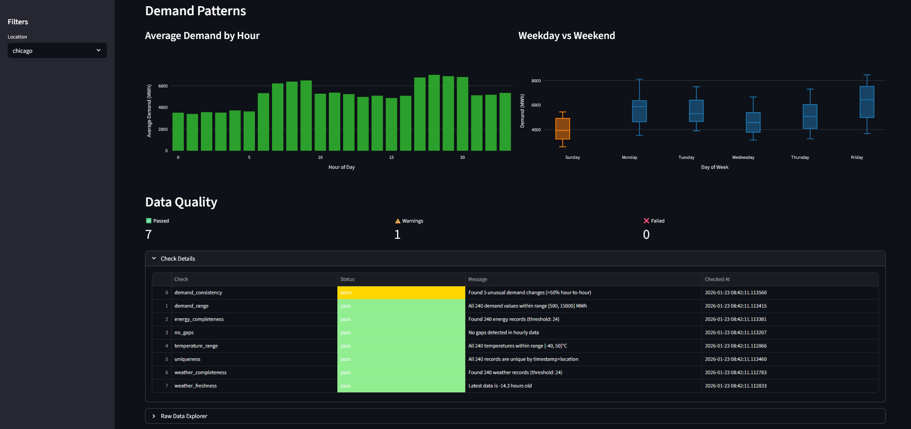

# EnergyPulse

Weather + energy demand pipeline. Fetches weather data, simulates energy demand, runs quality checks, computes metrics, displays in a dashboard.




```
Weather API → Quality Checks → Metrics → Streamlit Dashboard
                    ↓
                 DuckDB
```

## Architecture

```
┌─────────────┐     ┌─────────────┐     ┌─────────────┐     ┌─────────────┐
│   Weather   │────▶│   Quality   │────▶│   Metrics   │────▶│  Dashboard  │
│   Ingestion │     │   Checks    │     │   Engine    │     │  (Streamlit)│
└─────────────┘     └─────────────┘     └─────────────┘     └─────────────┘
       │                   │                   │                   │
       └───────────────────┴───────────────────┴───────────────────┘
                                    │
                              ┌─────▼─────┐
                              │  DuckDB   │
                              │  Storage  │
                              └───────────┘
```

## Quick Start

```bash
cd energypulse

# Install dependencies
uv sync

# Run the full pipeline (ingest → quality → metrics)
uv run energypulse run --location new_york --days 7

# Launch the dashboard
uv run streamlit run src/energypulse/dashboard/app.py
```

## Pipeline Stages

### 1. Data Ingestion

Fetches weather data from [Open-Meteo API](https://open-meteo.com/) (free, no API key required) and simulates correlated energy demand.

```bash
uv run energypulse ingest --location chicago --days 14
```

**Locations available**: new_york, los_angeles, chicago, houston, phoenix

The energy simulator models realistic demand patterns:
- Temperature-driven HVAC load (heating in cold, cooling in heat)
- Time-of-day patterns (morning ramp, evening peak, overnight valley)
- Weekend reduction (commercial buildings closed)

### 2. Quality Checks

Runs automated data quality validation:

```bash
uv run energypulse quality
```

**Checks performed**:
| Check | Description |
|-------|-------------|
| `completeness` | Minimum record count threshold |
| `freshness` | Most recent data within 48 hours |
| `temperature_range` | Values within -40°C to 50°C |
| `uniqueness` | No duplicate timestamp+location pairs |
| `no_gaps` | No missing hours in time series |
| `demand_range` | Energy demand within realistic bounds |
| `demand_consistency` | No >50% hour-to-hour spikes |

### 3. Semantic Metrics

Computes business metrics from raw data:

```bash
uv run energypulse metrics --location new_york
```

**Metrics computed**:
| Metric | Description |
|--------|-------------|
| `total_demand` | Sum of hourly demand (MWh) |
| `peak_demand` | Maximum hourly demand |
| `average_demand` | Mean hourly demand |
| `peak_hour_ratio` | Peak / Average (load variability) |
| `weekend_weekday_ratio` | Weekend avg / Weekday avg |
| `peak_hour_demand` | Average during 5-8 PM |
| `overnight_minimum` | Average during 12-5 AM (base load) |
| `temperature_sensitivity` | Correlation between temp and demand |

### 4. Dashboard

Interactive Streamlit dashboard with:
- Key metrics summary (total, peak, average demand)
- Time series of energy demand
- Temperature vs demand scatter plot
- Hourly demand patterns
- Weekday vs weekend comparison
- Data quality status

```bash
uv run streamlit run src/energypulse/dashboard/app.py
```

## Sample Output

### CLI Quality Checks
```
┏━━━━━━━━━━━━━━━━━━━━━━━┳━━━━━━━━┳━━━━━━━━━━━━━━━━━━━━━━━━━━━━━━━━━━━━━━┓
┃ Check                 ┃ Status ┃ Message                              ┃
┡━━━━━━━━━━━━━━━━━━━━━━━╇━━━━━━━━╇━━━━━━━━━━━━━━━━━━━━━━━━━━━━━━━━━━━━━━┩
│ weather_completeness  │ PASS   │ Found 168 weather records            │
│ weather_freshness     │ PASS   │ Latest data is 2.3 hours old         │
│ temperature_range     │ PASS   │ All 168 temperatures within range    │
│ uniqueness            │ PASS   │ All 168 records are unique           │
│ no_gaps               │ PASS   │ No gaps detected in hourly data      │
│ energy_completeness   │ PASS   │ Found 168 energy records             │
│ demand_range          │ PASS   │ All 168 demand values within range   │
│ demand_consistency    │ PASS   │ Demand changes are consistent        │
└───────────────────────┴────────┴──────────────────────────────────────┘

8/8 checks passed
```

### CLI Metrics Output
```
┏━━━━━━━━━━━━━━━━━━━━━━━━━━━┳━━━━━━━━━━━━━━┳━━━━━━━━━━━━━┓
┃ Metric                    ┃        Value ┃ Unit        ┃
┡━━━━━━━━━━━━━━━━━━━━━━━━━━━╇━━━━━━━━━━━━━━╇━━━━━━━━━━━━━┩
│ total_demand              │   847,234.56 │ MWh         │
│ peak_demand               │     7,842.31 │ MWh         │
│ average_demand            │     5,043.06 │ MWh         │
│ peak_hour_ratio           │         1.56 │ ratio       │
│ weekend_weekday_ratio     │         0.78 │ ratio       │
│ peak_hour_demand          │     6,521.44 │ MWh         │
│ overnight_minimum         │     3,542.18 │ MWh         │
│ temperature_sensitivity   │         0.42 │ correlation │
└───────────────────────────┴──────────────┴─────────────┘
```

## Tech Stack

- **Python 3.11+** with strict type hints
- **Pydantic 2** for data validation
- **DuckDB** for local analytics storage
- **httpx** for async-capable HTTP
- **Typer + Rich** for CLI
- **Streamlit + Plotly** for dashboard
- **structlog** for structured logging
- **pytest** for testing

## Project Structure

```
energypulse/
├── src/energypulse/
│   ├── ingestion/        # Weather API + energy simulation
│   │   ├── weather.py    # Open-Meteo client
│   │   └── energy.py     # Demand simulator
│   ├── quality/          # Data quality checks
│   │   └── checks.py     # Check implementations
│   ├── metrics/          # Semantic metrics layer
│   │   └── definitions.py
│   ├── dashboard/        # Streamlit app
│   │   └── app.py
│   ├── models.py         # Pydantic data models
│   ├── storage.py        # DuckDB persistence
│   └── cli.py            # Typer CLI
├── tests/                # pytest test suite
├── data/                 # DuckDB database (gitignored)
└── pyproject.toml
```

## Running Tests

```bash
# Run all tests
uv run pytest

# With coverage
uv run pytest --cov=energypulse --cov-report=term-missing

# Run specific test file
uv run pytest tests/test_quality.py -v
```

## Design Decisions

**Why simulate energy data?**
Real energy grid data requires registration/agreements. Simulation lets us demonstrate the full pipeline while showing domain knowledge (HVAC load curves, time-of-day patterns, weekend effects).

**Why DuckDB?**
Embedded OLAP database perfect for analytics workloads. No server setup, great Python integration, fast columnar queries.

**Why Open-Meteo?**
Free API, no registration required, historical data available. Perfect for portfolio projects.

## License

MIT
