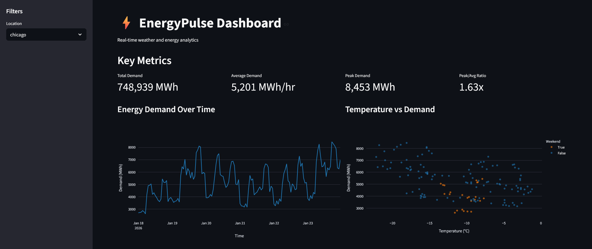
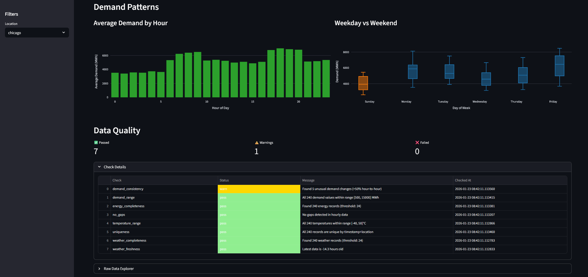

# EnergyPulse

Weather + energy demand pipeline. Fetches weather data, simulates energy demand, runs quality checks, computes metrics, displays in a dashboard.




```
Weather API → Quality Checks → Metrics → Streamlit Dashboard
                    ↓
                 DuckDB
```

## Architecture

```
┌─────────────┐     ┌─────────────┐     ┌─────────────┐     ┌─────────────┐
│   Weather   │────▶│   Quality   │────▶│   Metrics   │────▶│  Dashboard  │
│   Ingestion │     │   Checks    │     │   Engine    │     │  (Streamlit)│
└─────────────┘     └─────────────┘     └─────────────┘     └─────────────┘
       │                   │                   │                   │
       └───────────────────┴───────────────────┴───────────────────┘
                                    │
                              ┌─────▼─────┐
                              │  DuckDB   │
                              │  Storage  │
                              └───────────┘
```

## Quick Start

```bash
cd energypulse

# Install dependencies
uv sync

# Run the full pipeline (ingest → quality → metrics)
uv run energypulse run --location new_york --days 7

# Launch the dashboard
uv run streamlit run src/energypulse/dashboard/app.py
```

## Pipeline Stages

### 1. Data Ingestion

Fetches weather data from [Open-Meteo API](https://open-meteo.com/) (free, no API key required) and simulates correlated energy demand.

```bash
uv run energypulse ingest --location chicago --days 14
```

**Locations available**: new_york, los_angeles, chicago, houston, phoenix

Each city is queried in its own timezone, so timestamps are local wall-clock time and
hour-of-day patterns line up across cities.

The energy simulator models realistic demand patterns:
- Temperature-driven HVAC load (heating in cold, cooling in heat)
- Time-of-day patterns (morning ramp, evening peak, overnight valley)
- Weekend reduction (commercial buildings closed)

### 2. Quality Checks

Runs automated data quality validation:

```bash
uv run energypulse quality
```

**Checks performed** (9 total, 5 on weather and 4 on energy):
| Check | Description |
|-------|-------------|
| `weather_completeness` | At least 24 weather records |
| `weather_freshness` | Most recent weather data within 48 hours |
| `temperature_range` | Values within -40°C to 50°C |
| `weather_uniqueness` | No duplicate timestamp+location pairs in weather |
| `no_gaps` | No missing hours in the weather time series |
| `energy_completeness` | At least 24 energy records |
| `demand_range` | Energy demand within 500-15,000 MWh |
| `energy_uniqueness` | No duplicate timestamp+location pairs in energy |
| `demand_consistency` | No >50% hour-to-hour spikes |

### 3. Semantic Metrics

Computes business metrics from raw data:

```bash
uv run energypulse metrics --location new_york
```

**Metrics computed**:
| Metric | Description |
|--------|-------------|
| `total_demand` | Sum of hourly demand (MWh) |
| `peak_demand` | Maximum hourly demand |
| `average_demand` | Mean hourly demand |
| `peak_hour_ratio` | Peak / Average (load variability) |
| `weekend_weekday_ratio` | Weekend avg / Weekday avg |
| `peak_hour_demand` | Average during 5-8 PM |
| `overnight_minimum` | Average during 12-5 AM (base load) |
| `temperature_sensitivity` | Correlation between temp and demand |

### 4. Dashboard

Interactive Streamlit dashboard with:
- Key metrics summary (total, peak, average demand)
- Time series of energy demand
- Temperature vs demand scatter plot
- Hourly demand patterns
- Weekday vs weekend comparison
- Data quality status

```bash
uv run streamlit run src/energypulse/dashboard/app.py
```

## Sample Output

### CLI Quality Checks

From `uv run energypulse run --location new_york --days 7` on 2026-10-07:

```
┏━━━━━━━━━━━━━━━━━━━━━━┳━━━━━━━━┳━━━━━━━━━━━━━━━━━━━━━━━━━━━━━━━━━━━━━━━━━━━━━━━━━━━━━┓
┃ Check                ┃ Status ┃ Message                                             ┃
┡━━━━━━━━━━━━━━━━━━━━━━╇━━━━━━━━╇━━━━━━━━━━━━━━━━━━━━━━━━━━━━━━━━━━━━━━━━━━━━━━━━━━━━━┩
│ weather_completeness │ PASS   │ Found 192 weather records (threshold: 24)           │
│ weather_freshness    │ PASS   │ Latest data is -7.3 hours old                       │
│ temperature_range    │ PASS   │ All 192 temperatures within range [-40, 50]°C       │
│ weather_uniqueness   │ PASS   │ All 192 records are unique by timestamp+location    │
│ no_gaps              │ PASS   │ No gaps detected in hourly data                     │
│ energy_completeness  │ PASS   │ Found 192 energy records (threshold: 24)            │
│ demand_range         │ PASS   │ All 192 demand values within range [500, 15000] MWh │
│ energy_uniqueness    │ PASS   │ All 192 records are unique by timestamp+location    │
│ demand_consistency   │ WARN   │ Found 4 unusual demand changes (>50% hour-to-hour)  │
└──────────────────────┴────────┴─────────────────────────────────────────────────────┘

8/9 checks passed
```

The forecast endpoint returns the rest of today's hours too, which is why the record
count is 192 (8 days) and the freshness age is negative.

### CLI Metrics Output
```
┏━━━━━━━━━━━━━━━━━━━━━━━━━┳━━━━━━━━━━━━┳━━━━━━━━━━━━━┓
┃ Metric                  ┃      Value ┃ Unit        ┃
┡━━━━━━━━━━━━━━━━━━━━━━━━━╇━━━━━━━━━━━━╇━━━━━━━━━━━━━┩
│ total_demand            │ 930,160.62 │ MWh         │
│ peak_demand             │   7,684.76 │ MWh         │
│ average_demand          │   4,844.59 │ MWh         │
│ peak_hour_ratio         │       1.59 │ ratio       │
│ weekend_weekday_ratio   │       0.74 │ ratio       │
│ peak_hour_demand        │   6,464.36 │ MWh         │
│ overnight_minimum       │   3,383.91 │ MWh         │
│ temperature_sensitivity │       0.16 │ correlation │
└─────────────────────────┴────────────┴─────────────┘
```

## Tech Stack

- **Python 3.11+** with strict type hints
- **Pydantic 2** for data validation
- **DuckDB** for local analytics storage
- **httpx** for async-capable HTTP
- **Typer + Rich** for CLI
- **Streamlit + Plotly** for dashboard
- **structlog** for structured logging
- **pytest** for testing

## Project Structure

```
energypulse/
├── src/energypulse/
│   ├── ingestion/        # Weather API + energy simulation
│   │   ├── weather.py    # Open-Meteo client
│   │   └── energy.py     # Demand simulator
│   ├── quality/          # Data quality checks
│   │   └── checks.py     # Check implementations
│   ├── metrics/          # Semantic metrics layer
│   │   └── definitions.py
│   ├── dashboard/        # Streamlit app
│   │   └── app.py
│   ├── models.py         # Pydantic data models
│   ├── storage.py        # DuckDB persistence
│   └── cli.py            # Typer CLI
├── tests/                # pytest test suite
├── data/                 # DuckDB database (gitignored)
└── pyproject.toml
```

## Running Tests

pytest, ruff and mypy live in the `dev` extra, which plain `uv sync` does not install.

```bash
# Install runtime deps plus the dev extra
uv sync --all-extras

# Run all tests
uv run pytest

# With coverage
uv run pytest --cov=energypulse --cov-report=term-missing

# Run specific test file
uv run pytest tests/test_quality.py -v
```

## Design Decisions

**Why simulate energy data?**
Real energy grid data requires registration/agreements. Simulation lets us demonstrate the full pipeline while showing domain knowledge (HVAC load curves, time-of-day patterns, weekend effects).

**Why DuckDB?**
Embedded OLAP database perfect for analytics workloads. No server setup, great Python integration, fast columnar queries.

**Why Open-Meteo?**
Free API, no registration required, historical data available. Perfect for portfolio projects.

## License

MIT
